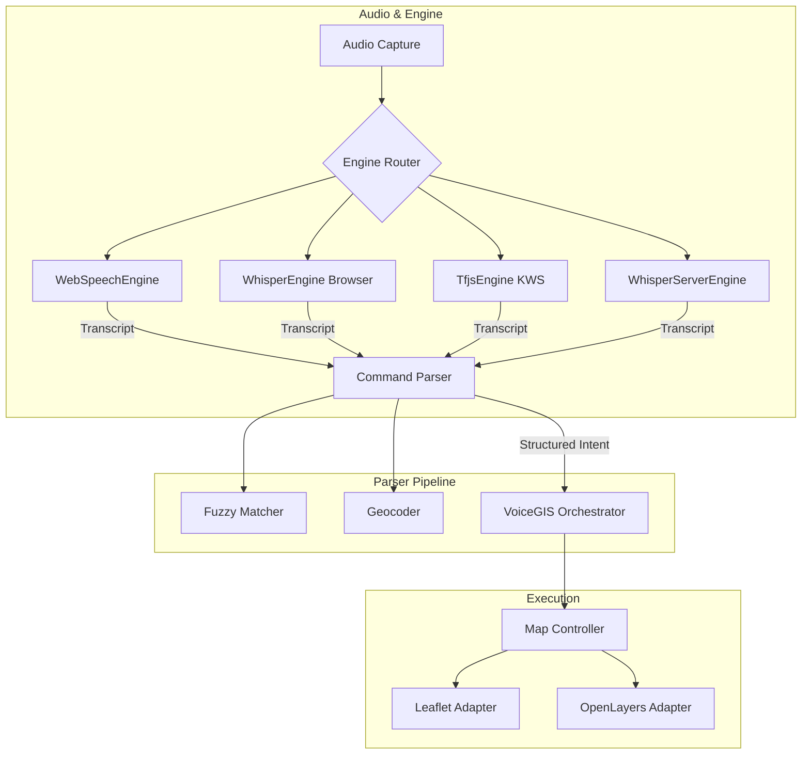

# VoiceGIS Architecture Deep Dive

VoiceGIS is designed with a strict modular architecture that separates voice recognition, text parsing, map control, and the UI layer. This allows developers to dynamically route audio based on network conditions, or swap out the underlying map engine.

## System Diagram

## Modules

### 1. Engines (`src/engines/`)
Responsible for converting speech to text. We implement a Hybrid strategy with multiple profiles:
- **WebSpeechEngine**: A wrapper around the browser's native `SpeechRecognition` API. Instant and highly accurate, but requires an internet connection and sends audio to the cloud.
- **WhisperEngine**: Uses Transformers.js and ONNX runtime to execute OpenAI's Whisper model completely on-device. Audio is captured via Web Audio API, downsampled to 16kHz, and processed locally. Requires downloading a large model (e.g., `whisper-base.en`).
- **TfjsEngine**: A keyword spotter using `@tensorflow-models/speech-commands`. Acts as an "Offline Command Mode" with a tiny footprint for extremely constrained edge usage.
- **WhisperServerEngine**: Posts audio buffers as WAV blobs to a configurable HTTP endpoint (e.g. `whisper.cpp` backend) for self-hosted enterprise deployments.

### 2. Parser (`src/parser/`)
Responsible for turning raw transcript text into structured actionable JSON.
- **CommandParser**: Extracts the intent (e.g., `GO_TO`, `ZOOM_IN`) and payload (e.g., `place: "Ahmedabad"`).
- **FuzzyMatch**: Uses the Levenshtein distance algorithm to gracefully handle typos (e.g., matching "Satlite" to `satellite`).
- **Geocoder**: Wraps the Nominatim API to convert place names to Coordinates. Includes an LRU cache and rate-limiting to respect OSM's usage policies.

### 3. Map (`src/map/`)
Responsible for executing the map actions. Uses the Adapter pattern.
- **MapController**: The unified API (`goTo()`, `zoomIn()`, `showLayer()`).
- **LeafletAdapter / OpenLayersAdapter**: The actual implementations that interface with the respective libraries.

### 4. Orchestrator (`src/VoiceGIS.js`)
The `VoiceGIS` class acts as the Facade. It implements an `auto` routing strategy that intelligently switches between WebSpeech, Whisper, and TF.js based on network availability and browser support. It dynamically instantiates the appropriate engine, pipes transcripts into the parser, and executes the resulting actions on the map.

## Deployment Profiles

VoiceGIS provides deployment profiles mapped to real-world operational constraints:

1. **Mainstream Consumer (Auto)**: Defaults to cloud-based WebSpeech for instantaneous response, but seamlessly fails over to Whisper if the user loses connectivity (e.g., in a tunnel or remote field).
2. **Secure Intranet (Server)**: Connects to a private self-hosted API, guaranteeing no audio data ever leaves the corporate firewall.
3. **True Edge (Command Mode)**: Only uses the tiny TF.js KWS engine, fitting comfortably onto low-power embedded tablets in completely disconnected environments.

## PWA & Offline Strategy

VoiceGIS uses a Service Worker to provide offline capabilities:
1. **App Shell**: The UI, JS bundles, and CSS are cached immediately upon installation.
2. **AI Model**: Transformers.js automatically caches the ONNX model weights in the browser's Cache API (`transformers-cache`).
3. **Map Tiles**: While dynamic tile caching is complex, basic vector tiles or low-res base layers can be cached by configuring Leaflet/OpenLayers plugins.
4. **Offline Fallback**: If the device is offline, the Geocoder falls back to a hardcoded `CITY_COORDS` dictionary instead of making network requests to Nominatim.
